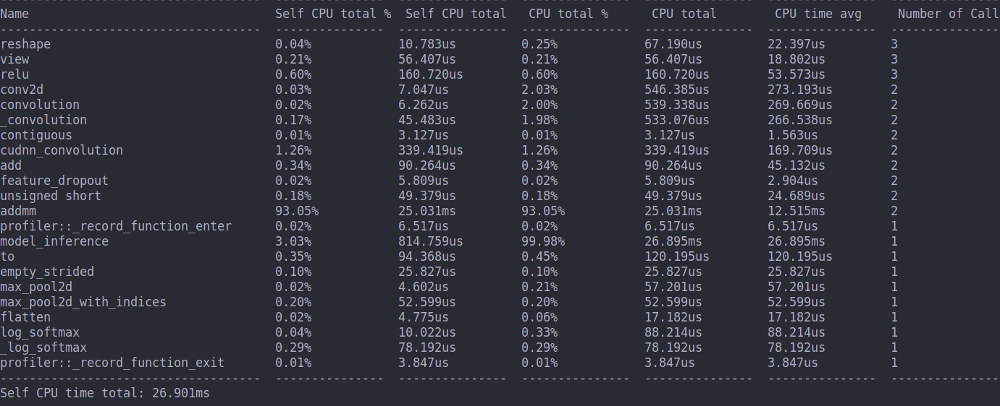

## 实验报告

### 实验环境

||||
|--------|--------------|--------------------------|
|硬件环境|CPU（vCPU数目）|8  Intel(R) Core(TM) i5-8300H CPU  @ 2.30GHz |
||GPU(型号，数目)|GeForce GTX 1050 Ti Mobile|
|软件环境|OS版本|ubuntu 18.04|
||深度学习框架 python包名称及版本|pytorch-gpu 1.5.0|
||CUDA版本|cuda 10.01|
||||

### 实验结果

1. 模型可视化结果截图
   
|||
|---------------|---------------------------|
| &nbsp; 神经网络数据流图 &nbsp; &nbsp;||
| &nbsp; 损失和正确率趋势图 &nbsp; &nbsp;||
| &nbsp; 网络分析，使用率前十名的操作 &nbsp; &nbsp;||
||||

2. 网络分析，不同批大小结果比较

|||
|------|--------------|
|批大小 &nbsp;| &nbsp; &nbsp; &nbsp; &nbsp; &nbsp; 结果比较 &nbsp; &nbsp; &nbsp; &nbsp; &nbsp; |
| &nbsp; 1 &nbsp; &nbsp;||
| &nbsp; 16 &nbsp; &nbsp;||
| &nbsp; 64 &nbsp; &nbsp;||
|||

### 实验分析
1. 在一个epoch内,大的batch size的训练过程需要的batch数目少，所以能够减少训练时间。
2. 每次反向传播的梯度是对batch内样本的梯度平均之后的结果，所以batch size小时相邻iteration差异大，梯度震荡情况严重，不利于收敛；batch szie越大相邻iteration差异小，梯度震荡减轻，在一定程度上有利于收敛。
3. 过大的batch size会使loss收敛到sharp minimum,泛化能力差。